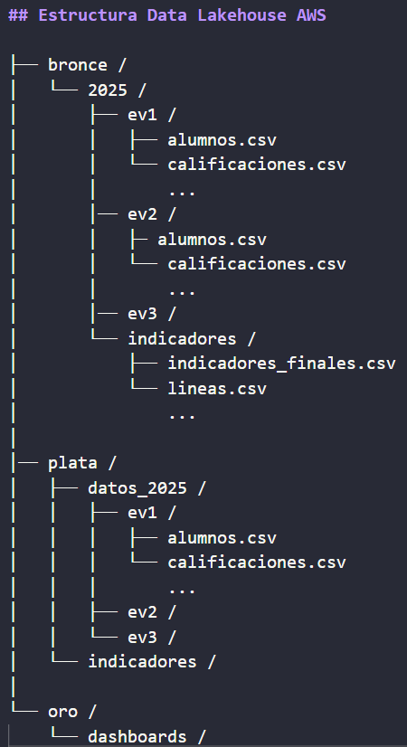

# ANALISIS ACADEMICO

**Objetivo:** Ayudar a un centro educativo a entender sus resultados académicos. Partiremos de varios ficheros CSV "sucios" y los transformaremos en un sistema de Business Intelligence (BI) coherente que permita tomar decisiones.

## Tareas

### Tarea 1. Inspeccion datos

Anotaciones de respuestas

¿Cuál es el separador de columnas (coma , o punto y coma ;)?
    El separador es un punto y coma en "Indicadores_Finales" y una coma en el resto de ficheros 

¿La primera fila contiene los nombres de las columnas (encabezados)? ¿Son claros?
    la primera fila continee los nombres de las columnas separadas por coma de manera bastante clara

Inspecciona visualmente las primeras 20-30 filas. ¿Ves valores que te parezcan extraños o que faltan (celdas vacías, "N/A", "s/d")?
    En "Indicadores_Finales" hay datos vacíos representados por cadenas de punto y coma, pero el resto de ficheros no tienen celdas vacías

¿Los formatos son consistentes? Por ejemplo, ¿las fechas están siempre como DD/MM/AAAA o a veces cambian?
    Los formatos parecen bastante consistentes

Identifica las "claves" o "IDs" que podrían servir para relacionar unos ficheros con otros (ej: id_alumno en el fichero de calificaciones.csv y también en alumnos.csv).
    He decidido desarrollar este apartado con diagramas, adjunto las imágenes
    
    

## Estructura Data Lakehouse AWS

├── bronce /
│   └── 2025 /
│       ├── ev1 /
│       │   ├── alumnos.csv
│       │   └── calificaciones.csv
│       │       ...
│       │── ev2 /
│       │   ├─ alumnos.csv
│       │   └── calificaciones.csv
│       │       ...
│       │── ev3 /
│       └── indicadores /
│           ├── indicadores_finales.csv
│           └── lineas.csv
│               ...
│
│── plata /
│   ├── datos_2025 /
│   │   ├── ev1 /
│   │   │   ├── alumnos.csv
│   │   │   └── calificaciones.csv
│   │   │       ...
│   │   ├── ev2 /
│   │   └── ev3 /
│   └── indicadores /
│
└── oro /
    └── dashboards /

Lo añado también como imagen porque creo que se ve mal en github:

## Base de datos RDS MySQL

BBDD: analisis-academico
User: admin
Passwd: admin1234
url: analisis-academico.ccyxmilxfgxq.us-east-1.rds.amazonaws.com

## Tabla de Hechos y Dimensiones

